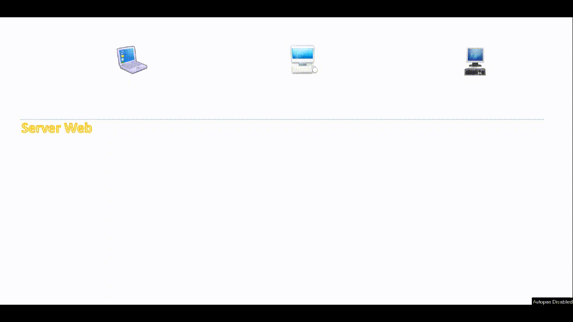

# SingleSessionUser

This project describes and implements a verification process that allows for a single user session from multiple devices.

## Basic concept

When a client connects to a website, it creates a session for that specific client, identifying this session with an ID called SessionID. The SessionID is conceptually unique, but it is possible to implement a manager that allows you to customize the syntax of the SessionID itself (for example with a GUID or other generation algorithm).

https://learn.microsoft.com/en-us/dotnet/api/system.web.sessionstate.sessionidmanager?view=netframework-4.8

The basic idea is to create a SessionID strictly linked to the user, that is a SessionID that is always the same for the same user, regardless of where he connects (device, browser, etc...).

In this way the two connected clients will share the same session and the changes made on one side will be visible on the other. On the contrary, the cookies set on the browser of both clients will remain personal.

>To see the effect of the above, it is possible to comment on the "LoginStatusChecker" decorator, placed as an attribute of the "Home" controller. **ATTENTION**: the changes may be visible at the next request, do not update the page after login, but load it normally, browsing the home again.

Taking advantage of this characteristic of the created scenario, it is possible to consider the possibility of generating the customized SessionID following a successful login, and at the same time generate a random value that will be saved both as a variable in session and as a cookie on the client's browser . In this way, when a new login by the same user is made from another device, the process will be carried out again. At this point, we will have a common session shared by both clients, with the randomly generated value of the last login. However, the client with the correct cookie will only be one, the last one who logged in.
To complete the process, just check the session value with that of the cookie for each request made by the client and disconnect the user, if they differ.

## Basic concept in video

